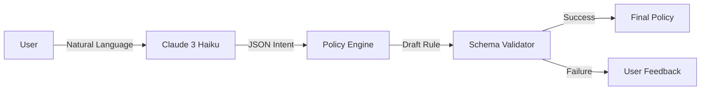

# System Design & Architecture

## Architecture Overview

The system implements a **Hybrid Intelligence** architecture where an LLM (Claude 3) provides intent understanding, while a deterministic Code Engine ensures safety and correctness.

### Components

#### 1. Processing Engine (`engine.js`)
The Engine is the central orchestrator. It uses a **Slot-Filling State Machine** to handle ambiguity.
*   **State Accumulation**: If a user says "Admins...", the system enters a "Waiting for Resource/Action" state.
*   **Context Management**: It keeps a `draft` object that persists across turns until a full rule is formed.
*   **Regex Fallback**: If the LLM API fails or is slow, a robust Regex engine can handle ~80% of standard inputs (e.g., "Grant [Role] [Action] on [Resource]").

#### 2. Anti-Hallucination Layer
LLMs are prone to inventing roles or actions. We solve this with a strict verification step:
1.  **Discovery**: On startup, we fetch valid Roles/Resources from `mockRegistry.js`.
2.  **Cross-Reference**: Every entity extracted by the LLM is checked against this list.
3.  **Sanitization**: Unknown entities are explicitly flagged as `UNKNOWN` rather than being guessed.

#### 3. Storage & Persistence
*   **Strategy**: Local Filesystem (`session.json`).
*   **Why**:
    *   **Simplicity**: No database dependencies (easier for assignment reviews).
    *   **Portability**: The entire state fits in a Git repo (excluding storage).
    *   **Atomicity**: Node.js `fs.writeFileSync` is atomic for small files, suitable for this scale.

## Key Design Decisions & Trade-offs

### 1. Hybrid Intelligence (AI + Deterministic Code)
*   **Decision:** We do not rely solely on the LLM to write the policy.
*   **Reasoning:** LLMs can hallucinate (e.g., "SuperUsers", "Eat"). Deterministic code provides 100% safety guarantees.
*   **Trade-off:** Slightly more code to write (Validation logic) vs. "Magic" (Pure Prompt Engineering). We chose **Safety**.

### 2. Immediate vs Final Validation
*   **Immediate Validation**:
    *   **What**: Checks if inputs *exist* in the schema (e.g., Is "Intern" a role?).
    *   **When**: During the chat.
    *   **Why**: Fast feedback loop.
*   **Final Validation**:
    *   **What**: Checks *business rules* (e.g., Can Viewers delete?).
    *   **When**: When saving the policy.
    *   **Why**: Separation of "Syntax" vs "Semantics".

### 3. Client-Side Rendering vs Server-Side
*   **Decision**: React SPA (Single Page Application).
*   **Reasoning**: Better interactivity for the chat interface. A server-rendered page would reload on every message, breaking immersion.

### 4. Mock Registry Latency
*   **Decision**: Added `50ms` delay to Mock APIs.
*   **Reasoning**: To simulate real microservices. This forced us to make `storage.init()` async and handle loading states properly.

## Future Improvements
1.  **Database**: Migrate `session.json` to SQLite or Redis for multi-user support.
2.  **Vector Search**: For larger schemas (thousands of roles), Regex/Array search is inefficient. A vector store would help find semantically similar roles.
3.  **Audit Logs**: Persist a history of *who* made changes to the policy.
