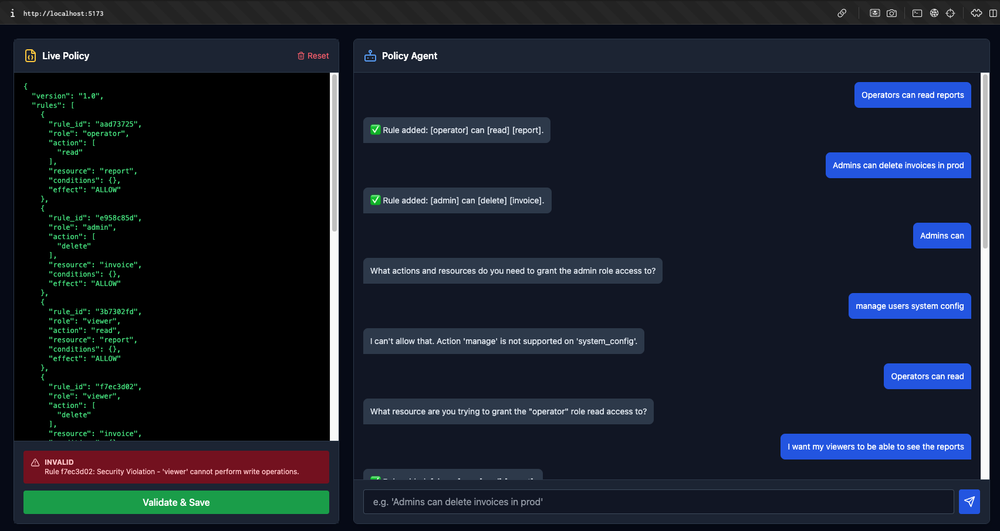

# 🛡️ RBAC Policy Engine (Agentic AI)

A robust, AI-powered **Role-Based Access Control (RBAC)** Policy Engine designed to interpret natural language instructions, validate them against strict business rules, and generate secure JSON policies.



## 🚀 Key Features

*   **🗣️ Natural Language Interface:** Use plain English to create complex rules (e.g., *"Admins can delete invoices in prod"*).
*   **🤖 AI Agent (Claude 3):** Powered by Anthropic's Claude 3 Haiku for intelligent entity extraction, ambiguity resolution, and smart contextual mapping (e.g., "manage" -> "update").
*   **🛡️ Anti-Hallucination Guard:** A "Trust but Verify" architecture. The Agent extracts intent, but the deterministic **Validator** strictly enforces the schema (e.g., rejecting "SuperUser" if it doesn't exist).
*   **🔒 Partial Revocation:** Smartly handles complex updates. If an Admin has `[Read, Delete]` and you say *"Admins cannot delete"*, the system preserves the `Read` permission.
*   **💾 Resilience & Recovery:** State is persisted to a local JSON filesystem using **Async I/O** for performance.
*   **📜 Audit Logging:** Tracks every policy change and system reset in `storage/audit.log` for security compliance.
*   **📝 Live Preview:** Real-time JSON visualization of the policy as it is being built.

---

## 🏗️ Architecture

The system follows a **Controller-Service-Repository** pattern, enhanced with an **Agentic Layer**.

```mermaid
graph TD
    User[User] -->|Chat Message| FE[Frontend (React)]
    FE -->|API Request| BE[Backend (Express)]
    BE --> Engine[Processing Engine]
    
    subgraph "Intelligent Layer"
    Engine -->|Prompt| LLM[Claude 3 Haiku]
    LLM -->|Extraction| Engine
    end
    
    subgraph "Deterministic Layer"
    Engine -->|Draft Rule| Validator[Schema Validator]
    Validator -->|Validation Check| Mock[Mock Registry]
    end
    
    Validator -->|Success| Storage[Storage Service]
    Storage -->|Persist| Disk[(JSON Files)]
    
    Mock -.->|Ground Truth| Validator
```

### Components

1.  **Processing Engine (`engine.js`)**:
    *   **Orchestrator:** Handles the conversation loop.
    *   **Hybrid NLP:** Uses Claude 3 (AI) for complex extraction but falls back to Regex for speed/reliability if the API key is missing.
    *   **Anti-Hallucination:** Post-processes AI output to ensure strictly no invalid roles (e.g., "Interns") enter the system.
    *   **Smart Mapping:** Intelligently maps "manage" to "update" or "see" to "read".

2.  **Mock Registry (`mockRegistry.js`)**:
    *   Simulates external microservices (User Service, Resource Service).
    *   **Validator:** Validates policies against schema. Enforces business rules (e.g., *Viewer cannot write*).
    *   **Latency Simulation:** Adds realistic delays (50ms) to simulate network calls.

3.  **Storage Layer (`storage.js`)**:
    *   Persists `session.json` and `schema_cache.json` to the `storage/` disk folder.
    *   Ensures you can refresh the page and pick up where you left off.

---

## ⚙️ Installation & Setup

### Prerequisites
*   **Node.js** (v18 or higher)
*   **Docker** (Optional, for containerized run)
*   **Anthropic API Key** (Required for full AI capabilities)

### Configuration (`.env`)

You can configure the backend via environment variables:

| Variable | Description | Default |
| :--- | :--- | :--- |
| `ANTHROPIC_API_KEY` | Key for Claude 3 API | *None* |
| `LLM_MODEL_ID` | Specific Anthropic Model | `claude-3-haiku-...` |
| `MOCK_LATENCY_MS` | API Simulation Delay (ms) | `50` |

### Quick Start (Makefile)

The easiest way to run the project is using the Makefile:

```bash
# 1. Setup Docker containers
make setup

# 2. Run the application
make run
```
*   Frontend: `http://localhost:5173`
*   Backend: `http://localhost:4000`

### Manual Setup

**1. Backend**
```bash
cd backend
# Create .env file and add your ANTHROPIC_API_KEY=sk-...
npm install
npm start
```

**2. Frontend**
```bash
cd frontend
npm install
npm run dev
```

---

## 📖 Usage Guide

### 1. Creating Rules
Just type what you want!
> **User:** "Operators can read reports"
>
> **Agent:** `✅ Rule added: [operator] can [read] [report].`

### 2. Handling Ambiguity
If you are vague, the Agent will ask for clarity.
> **User:** "Admins can"
>
> **Agent:** "What resource does the admin need access to?"

### 3. Validating Security
The Agent is helpful, but the Validator is strict.
> **User:** "Viewers can delete invoices"
>
> **Agent:** `✅ Rule added...` (Agent allows it as a draft)
>
> **Action:** Click **[Validate & Save]**
>
> **System:** `❌ Security Violation - 'viewer' cannot perform write operations.`

### 4. Resetting
Click the **Reset (Trash Icon)** in the top-right to clear the session and start fresh.

---

## 📂 Project Structure

```
rbac-engine/
├── backend/                # Node.js Express Server
│   ├── src/
│   │   ├── services/       # Core Logic (Engine, Validator, Storage)
│   │   ├── routes.js       # API Endpoints
│   │   └── server.js       # Entry point
│   ├── storage/            # Persisted JSON files (Ignored in Git)
│   └── tests/              # Integration Tests
├── frontend/               # React + Vite Application
│   ├── src/
│   │   ├── components/     # UI Components (Chat, Preview)
│   │   └── App.jsx         # Layout Manager
├── docker-compose.yml      # Orchestration
├── Makefile                # Automation commands
├── DESIGN.md               # Architectural Decisions
└── TESTING.md              # Test Strategy & Edge Cases
```

## 🧪 Testing

We have a comprehensive integration test suite that verifies the core logic, including edge cases like Partial Revocation and Hallucination.

```bash
make test
```
See [TESTING.md](./TESTING.md) for details.